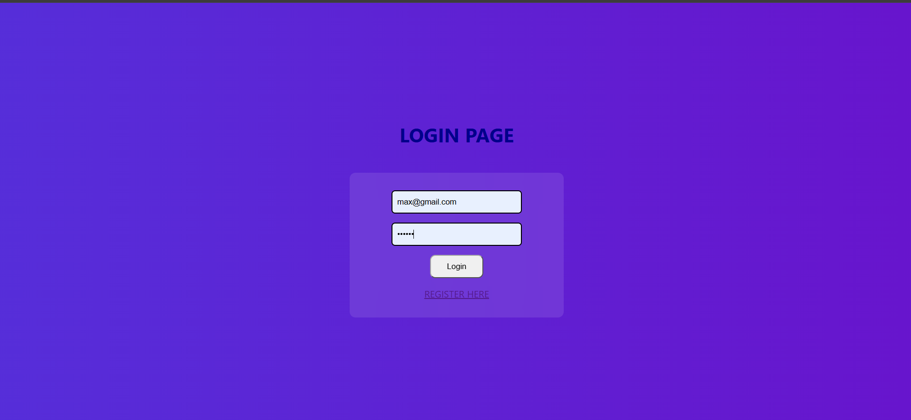
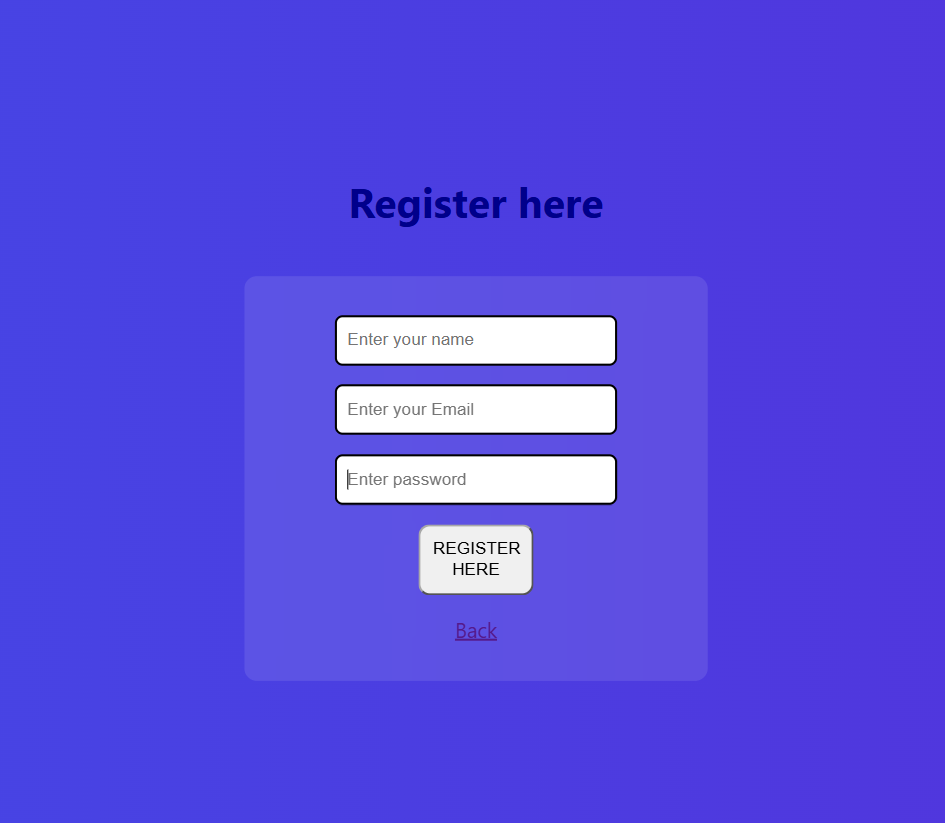
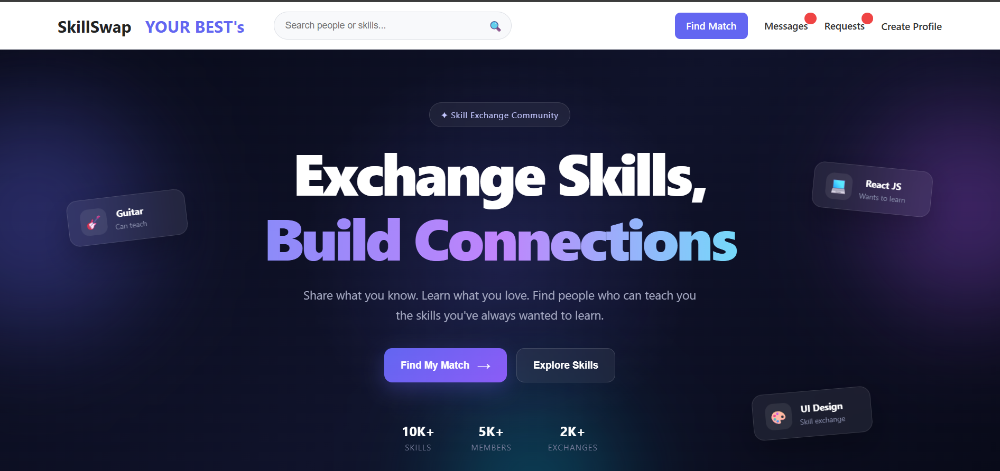
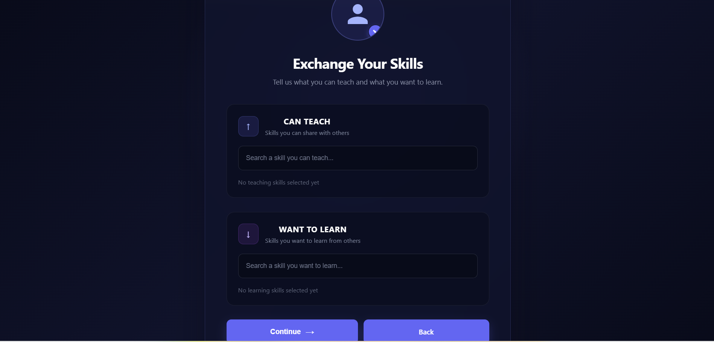
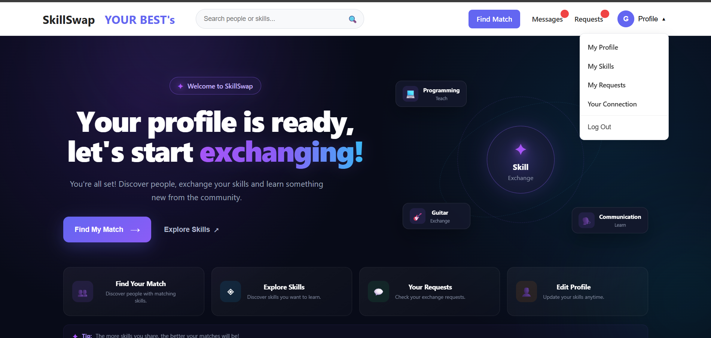

# SkillSwap

SkillSwap is a skill-exchange platform where people can list the skills they can teach, the skills they want to learn, and connect with others for skill exchanges — built with Next.js (App Router), MongoDB/Mongoose, and JWT authentication.

## ✦ Features

- **Authentication** — Register and log in with email and password, secured with JWT.
- **Profile Creation** — A guided flow for new users to add the skills they can teach and the skills they want to learn, with fuzzy search-as-you-type suggestions.
- **Profile Photo Upload** — Add a profile photo during setup.
- **Dynamic Navbar** — Automatically detects whether a user has completed their profile and adjusts the navigation (Create Profile vs. Profile dropdown).
- **Profile Dropdown Menu** — Quick access to My Profile, My Skills, My Requests, Your Connections, and Log Out.
- **Personalized Home Page** — Shows an onboarding hero section for new users, and a welcome banner with quick-action cards once a profile is created.
- **Skill Matching (planned/in progress)** — Find Your Match, Explore Skills, and Requests sections to connect with other users.
- **Responsive Design** — Mobile-friendly layouts across login, register, navbar, and home pages.

## ✦ Screens

| Screen | Description |
|---|---|
| **Login** | Email and password login with a link to register. |
| **Register** | Name, email, and password sign-up form. |
| **Home (before profile)** | Hero section introducing the platform, with "Find My Match" and "Explore Skills" call-to-actions. |
| **Exchange Your Skills** | Step in profile creation where users search and select skills they can teach and want to learn. |
| **Home (after profile)** | Personalized welcome banner, quick-action cards, and a profile dropdown in the navbar. |

## ✦ Screenshots

**Login**


**Register**


**Home — before profile creation**


**Exchange Your Skills — profile setup**


**Home — after profile creation**


## ✦ Tech Stack

- **Framework:** Next.js (App Router, Client Components)
- **Styling:** CSS Modules
- **Database:** MongoDB with Mongoose
- **Auth:** JWT (`jsonwebtoken`)
- **Skill Search:** Fuse.js (fuzzy search for skill autocomplete)
- **Utilities:** clsx (conditional class names)

## ✦ Project Structure

```
app/
├── home/
│   ├── page.js
│   ├── home.module.css
│   └── welcome/
│       ├── page.js
│       └── welcome.module.css
├── login/
│   └── page.js
├── register/
│   └── page.js
├── navbar/
│   ├── page.js
│   └── navbar.module.css
├── footer/
│   └── page.js
├── createProfile/
│   └── addSkills/
│       ├── page.js
│       └── addSkills.module.css
├── api/
│   └── auth/
│       ├── profile/
│       │   └── route.js
│       ├── checkProfile/
│       │   └── route.js
│       └── ...
lib/
├── controller/
│   ├── profileController.js
│   └── checkProfile.js
models/
├── User.js
└── Profile.js
```

## ✦ Getting Started

### Prerequisites

- Node.js installed
- A MongoDB database (local or MongoDB Atlas)

### Installation

```bash
git clone <your-repo-url>
cd skillswap
npm install
```

### Environment Variables

Create a `.env.local` file in the project root:

```
MONGODB_URI=your_mongodb_connection_string
JWT_SECRET=your_jwt_secret
```

### Run the Development Server

```bash
npm run dev
```

Open [http://localhost:3000](http://localhost:3000) in your browser.

## ✦ How It Works

1. **Register** — New users create an account with name, email, and password.
2. **Login** — Returns a JWT stored in `localStorage`, used to authenticate subsequent requests.
3. **Create Profile** — First-time users are guided to select skills they can teach and skills they want to learn, plus upload a profile photo.
4. **Home Page** — Checks whether a profile exists via `/api/auth/checkProfile`. If not, shows an onboarding hero section; if it exists, shows a personalized welcome banner with quick actions.
5. **Navbar** — Reflects profile status across the app, offering a profile dropdown (My Profile, My Skills, My Requests, Your Connections, Log Out) once a profile is created.

## ✦ Roadmap

- [ ] Find Match — matching algorithm based on complementary teach/learn skills
- [ ] Messaging between matched users
- [ ] Request management (send/accept/decline skill exchange requests)
- [ ] Full profile editing (name, email, skills, photo)
- [ ] Search functionality for people and skills
